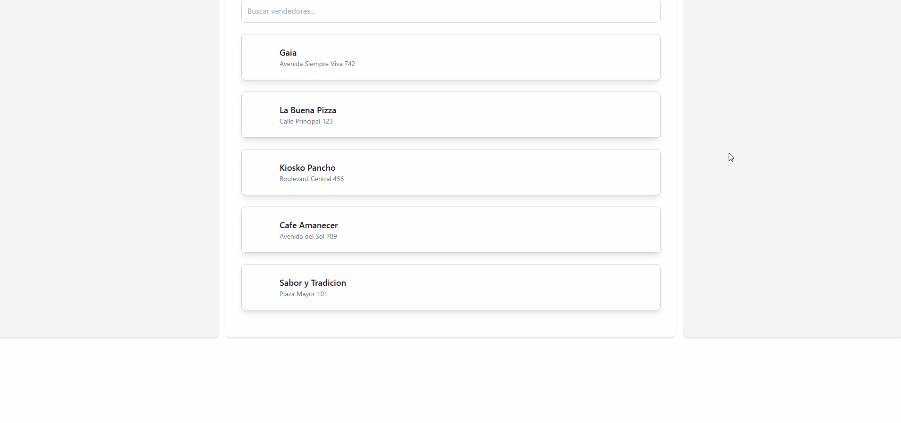

## Estado Actual del Proyecto



---

### Cosas Por Hacer

- Dar funcionalidad al buscar vendedores
- Hacer el code del crud para vendedor y cliente y probarlo con el thunder nomas, creeria que si no lo colocamos en la web no pasa nada.
- Hacer lo html de entidades no encontradas o que no hay en la bd (vendedores, items del vendedor)

---

## Tecnologías, Frameworks y APIs

- **Lenguajes:** Java, JavaScript
- **Frameworks:** Spring Boot, Thymeleaf
- **Bases de Datos:** MySQL
- **Estilos y Diseño:** TailwindCSS, PostCSS
- **Otras herramientas:** Lombok, REST APIs

---

## Recursos Adicionales

- **Control de versiones:** Git, GitHub
- **Gestor de dependencias:** Maven
- **Testing y pruebas:** Postman

---

### Configuración de TailwindCSS:

1. **Inicializar el proyecto (si no existe un `package.json`)**:

   ```bash
   npm init -y
   ```

2. **Instalar las dependencias de TailwindCSS, PostCSS y Autoprefixer**:

   ```bash
   npm install tailwindcss postcss autoprefixer
   ```

3. **Generar los archivos de configuración de Tailwind**:

   ```bash
   npx tailwindcss init
   ```

4. **Instalar PostCSS CLI**:

   ```bash
   npm install postcss-cli
   ```

### Compilación de TailwindCSS:

1. **Generar `output.css` (Tener Node.js instalado)**:

   ```bash
   npm run watch
   ```

### Script `package.json` para simplificar:

```json
"scripts": {
  "build": "npx tailwindcss -i ./src/styles.css -o ./dist/output.css",
  "watch": "npx tailwindcss -i ./src/styles.css -o ./dist/output.css --watch"
}
```

### Ejecución del Proyecto:

```bash
mvn spring-boot:run
```
