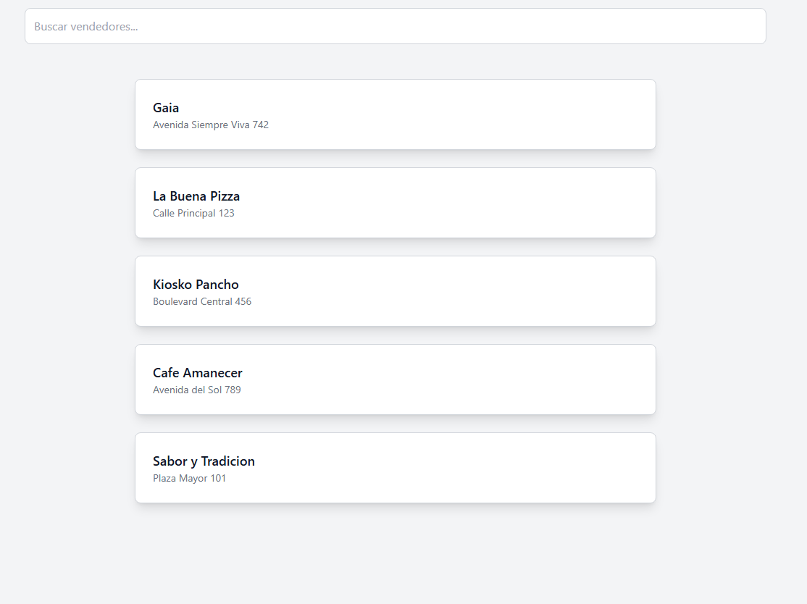

## Comandos a ejecutar para poder configurar tailwind
- npm init -y # Inicializar el proyecto si no hay un package.json
- npm install tailwindcss postcss autoprefixer
- npx tailwindcss init
- npm install tailwindcss postcss postcss-cli autoprefixer

## Ejecutar al clonar
- npm install
- npm run watch

## Estado actual de la pagina

### Cosas a por hacer

- Dar funcionalidad al buscar vendedores
- Al apretar el div de cada vendedor deberia redirigir a una lista de los productos del mismo
- Hacer algun filtrado para bebidas/plato en los productos
- Hacer el code del crud para vendedor y cliente y probarlo con el thunder nomas, creeria que si no lo colocamos en la web no pasa nada.
